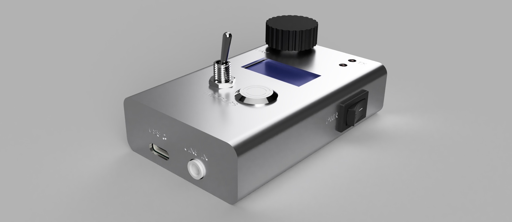

# SSTC-Interrupter

> Digital interrupter for driving SSTC/DRSSTC Tesla coils, built around the ESP32-S3.
Easily customizable and extensible thanks to the microcontroller platform.

**Actually in development!**

## Overview

This project implements a digital interrupter for Solid State Tesla Coils (SSTC) or Dual-Resonant SSTCs (DRSSTC). The interrupter allows precise control over the arc output using different control modes, making it easy to experiment with pulse timing, audio modulation, or MIDI control.

## Hardware Highlights

- Microcontroller: ESP32-S3 - powerful, friendly SDK, and USB-OTG.
- Isolation: Fiber-optic input using TOSLINK transceivers. Safe and affordable alternative to Broadcom HFBR14xx/24xx.
- Cost-effective: Total BOM under 20 €, including ESP32-S3, TOSLINK modules, and basic passive components.
- User interface: 164×64 OLED screen (running LVGL) with rotary encoder.
- Connectivity:
  - 3.5 mm line-in for audio modulation.
  - USB-OTG (serial, MIDI, ...)
  - TOSLINK/pin header outputs

## Features

**1. Manual Mode**

- Control three parameters directly using knobs:
  - Pulse Duration (PD) – width of each pulse.
  - Pulse Repetition Frequency (PRF) – pulse frequency.
  - Power – proportional to PD.
- Generates PWM signals from 1 Hz up to 20 kHz with a minimum pulse width of 1 µs.
- Ideal for manual experimentation and tuning the arc.WM carrier frequency is 30KHz by default, but you can adjust these value to fit your needs.

The signal generated is supposed to be ANDed with your main Tesla drive signal.

**2. Audio (Line-In) Mode**

- Connect any audio source via a 3.5 mm jack.
- Audio is sampled at 16 kHz and used to modulate the PWM output.
- Default PWM carrier frequency is 30 kHz, adjustable to match your Tesla coil system.
- Supports basic PWM modulation for now, but can be extended for other modulation schemes.

**3. MIDI Mode**

- Connect a MIDI device to control the arc in real time.
- Map MIDI notes to pulse patterns for musical performance with your Tesla coil.

## Notes

- The output of this module is intended to be ANDed with your main Tesla coil drive signal.
- All modes are fully software-driven on the ESP32-S3, making it easy to customize, extend, or add new modulation features.
